## java-web-1-simple-start

- [java-web-1-simple-start](#java-web-1-simple-start)
  - [写在前头](#写在前头)
  - [所谓JavaWeb](#所谓javaweb)
  - [JavaWeb运行环境](#javaweb运行环境)
  - [JavaWeb开发环境部署](#javaweb开发环境部署)
    - [Tomcat环境安装部署](#tomcat环境安装部署)
    - [部署过程中的问题](#部署过程中的问题)
      - [1.命令行窗口一闪而过](#1命令行窗口一闪而过)
      - [2.出现BindException](#2出现bindexception)
      - [3.运行startup.bat出现乱码问题](#3运行startupbat出现乱码问题)
    - [Idea中的JavaWeb环境搭建](#idea中的javaweb环境搭建)
    - [Eclipse中JavaWeb环境配置](#eclipse中javaweb环境配置)
  - [第一个Servlet](#第一个servlet)


### 写在前头

通过这个`README`，你将学会：

- 快速上手第一个`Servlet`
- 如何部署`JavaWeb`开发环境
- 常见的环境配置问题的处理

### 所谓JavaWeb

`JavaWeb`，是用`Java`技术来解决相关`web`互联网领域的技术栈。在`Internet`中供外界访问的`Web`资源一般分为两类：

- 静态`web`资源（如：`html`页面、图像、影视、程序等），无论在什么时间，什么地点，看到的内容都是一样的。
- 动态`Web`资源，指`web`页面中供人们浏览的数据是由程序产生的，不同时间点访问web页面看到的内容各不相同，最经典的莫过于系统登录成功之后显示的个人主页（`QQ`空间、微博个人主页等）。

在`Java`中，动态的`Web`资源开发技术统称`Java Web`。

### JavaWeb运行环境

因为动态资源是由程序生成的，`JavaWeb`中这种程序肯定就由`Java`语言来编写，所有的`Java`程序都需要`JVM`支持，在`JavaWeb`领域也不例外，然而，想要运行一个用来生成动态资源的使用`Java`编写的程序（这种程序有个名字，叫`servlet`，后面会介绍），除了需要`JVM`之外还需要一种叫`Web应用容器`的环境支撑。

因为一些庞大的系统会写很多个`servlet`，因此`Web应用容器`可以说是管理和运行`servlet`的地方。

常见的`Web`应用容器有很多，如：`Tomcat`（本`README`主要介绍这个）、`Undertow`、`Jetty`等。

### JavaWeb开发环境部署

#### Tomcat环境安装部署

首先需要去[Tomcat官网](https://tomcat.apache.org)下载`Tomcat`容器环境。下载之后你将会得到一个压缩包：

把这个压缩包解压，之后进去解压的文件夹里面，你讲看到：

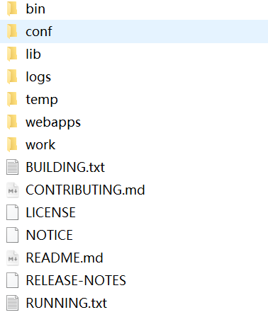

这个就是`Tomcat`的根目录，根目录里面的部分核心文件夹解释：

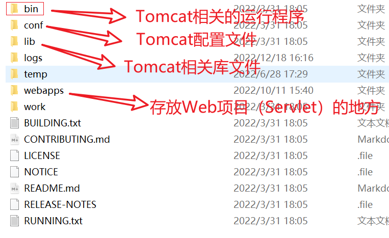

当你解压完之后，想要启动`Tomcat`，你可以去`Tomcat根目录/bin`里面找到一个叫`startup.bat`（`Windows`系统，`Linux`找`startup.sh`）的文件，双击运行会出现一个窗口：

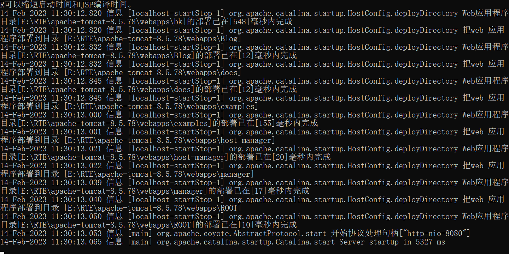

当底部出现`Server startup in XXXms`的对话的时候证明启动成功了，这个时候打开浏览器，输入`localhost:8080`，你将会看到`Tomcat`的欢迎页，代表`Tomcat`启动成功。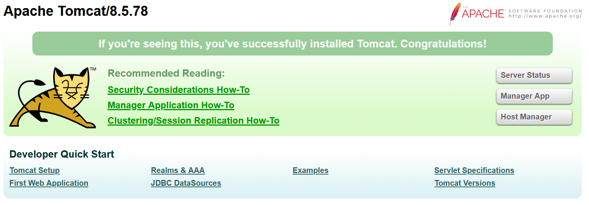

需要关闭`Tomcat`的时候，请打开`Tomcat根目录/bin`的`shutdown.bat`。

#### 部署过程中的问题

##### 1.命令行窗口一闪而过

`Tomcat`的运行需要`JDK`，出现这个问题大概率是没有配置好`JAVA_HOME`，配置一下`JAVA_HOME`环境变量即可

##### 2.出现BindException

端口被占用，先关闭当前占用`8080`端口的应用，或者修改`Tomcat`端口。

关闭端口应用的方法：

1. 运行`CMD`输入`netstat -ano | findstr "8080"`，会输出下类似的信息：

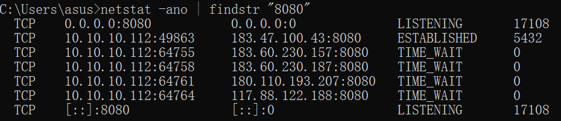

其中信息最后的`17108`是进程的`PID`，上面的指令中：

`-a`是显示所有连接和侦听端口，`-n`是以数字形式显示地址和端口号，`-o`是显示拥有的与每个连接关联的进程 ID，后面的`findstr`是过滤，让其显示只包含`8080`的项，作用相当于`Linux`中的`grep`。

2. 然后运行`taskkill -pid [PID] -f`强制关闭进程，如上图就是`taskkill -pid 17180 -f`。

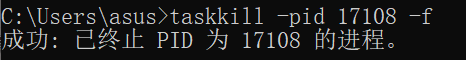

另外一种方法是：修改端口，需要去`Tomcat根目录/conf/server.xml`里面，找到：

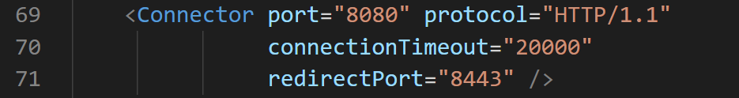

大概在`69`行左右，`port`属性就是端口，修改即可。

##### 3.运行startup.bat出现乱码问题

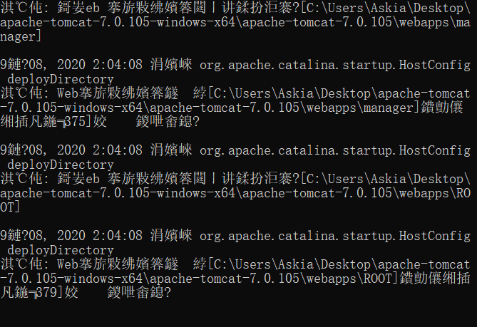

遇到这个问题需要改一下输出日志的编码，找到`Tomcat根目录\conf\logging.properties`，修改：

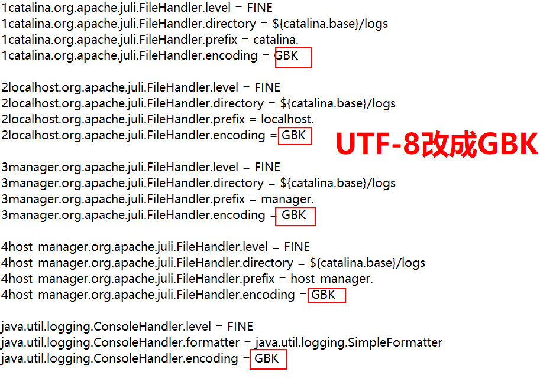

#### Idea中的JavaWeb环境搭建

一种推荐的方式是`Maven`工程方式创建：

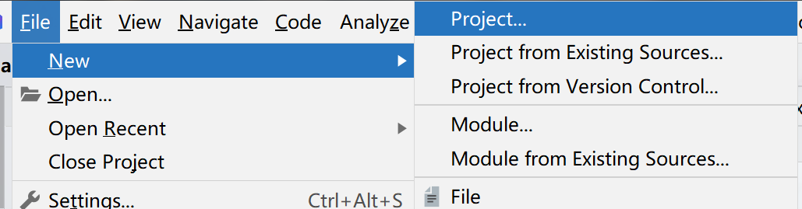

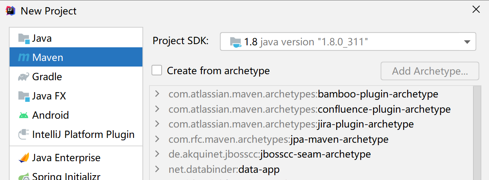

创建项目完成之后右键项目，选择：


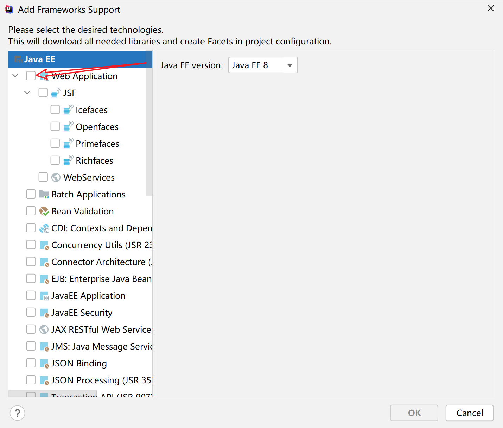

之后看到工程多了个`Web`的文件夹：这个时候`Web`工程内容就差不多配置好了。

现在就剩下配置`Tomcat`了，找到这个地方

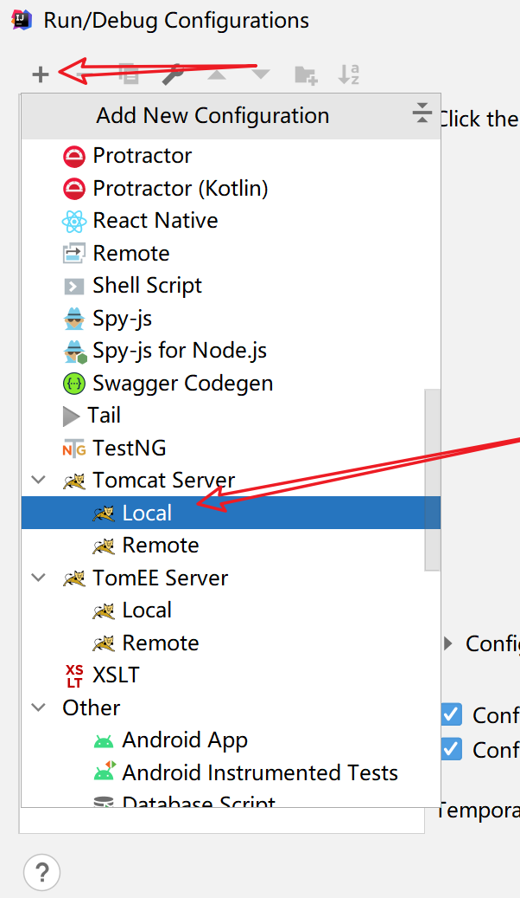

点击

点击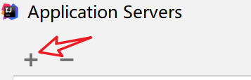

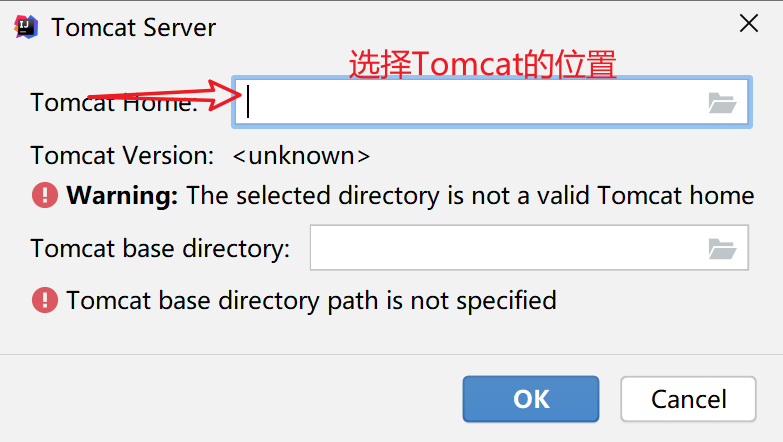

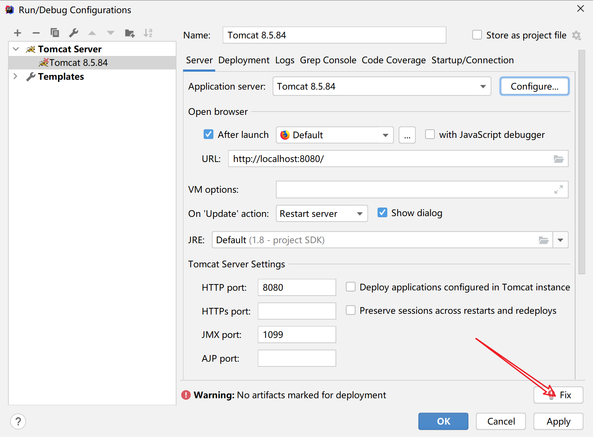

这样`Idea`的环境就配置好了。

最后你需要导入`Servlet`的`API`，在`pom`文件中，导入：

```xml
<dependency>
    <groupId>javax.servlet</groupId>
    <artifactId>javax.servlet-api</artifactId>
    <version>4.0.1</version>
</dependency>
<dependency>
    <groupId>javax.servlet.jsp</groupId>
    <artifactId>javax.servlet.jsp-api</artifactId>
    <version>2.3.1</version>
</dependency>
```

其中：`javax.servlet-api`是`Servlet`的`API`，带`jsp`的是`jsp`文件的，实际上`jsp`也算是一个`Servlet`。

#### Eclipse中JavaWeb环境配置

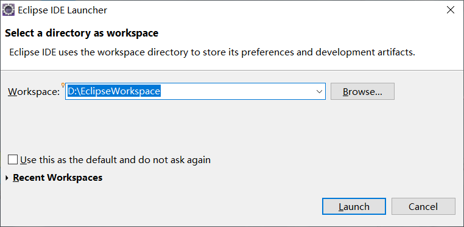

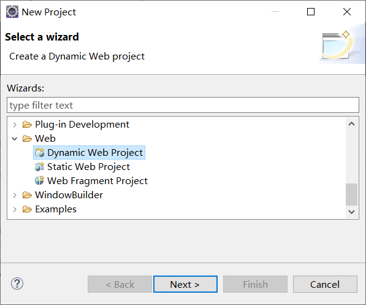

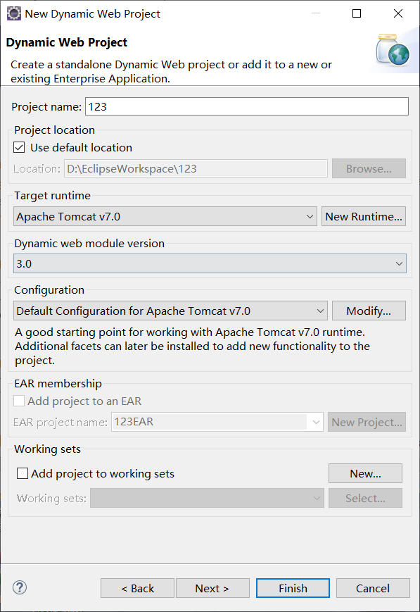

### 第一个Servlet

环境部署完了之后，就可以编写第一个`Servlet`了，因为`Servlet`本质上就是一个`Java`类，创建一个简单的`Servlet`的步骤可以按照下面几步来：

1. 创建一个`Java`类，这个类一般以`XXXServlet`命名，如：`HelloServlet`

2. 让这个类继承`HTTPServlet`

3. 重写`doGet`、`doPost`方法，让`doPost`调用`doGet`或者`doGet`调用`doPost`

4. 在创建的`Servlet`类上面加上`@WebServlet`注解，并写上路径

代码截图如下，你可以参考源代码:`src/main/java/cn/argentoaskia/HelloServlet.java`

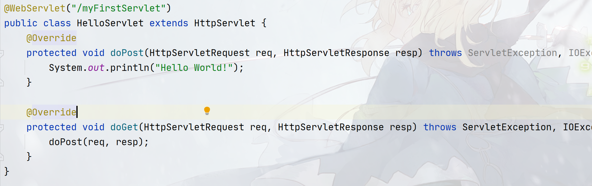


